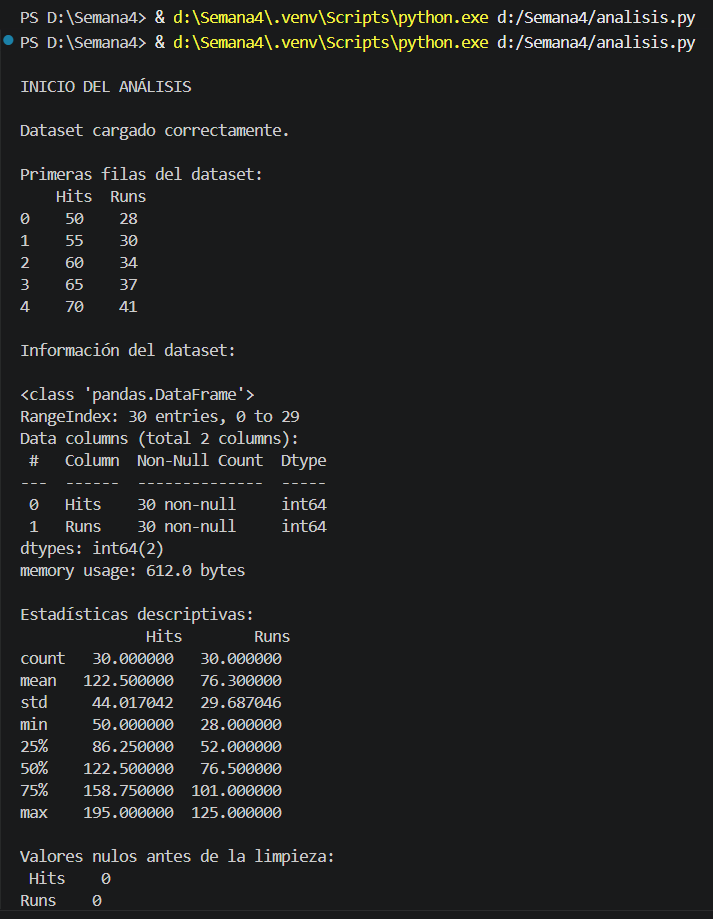
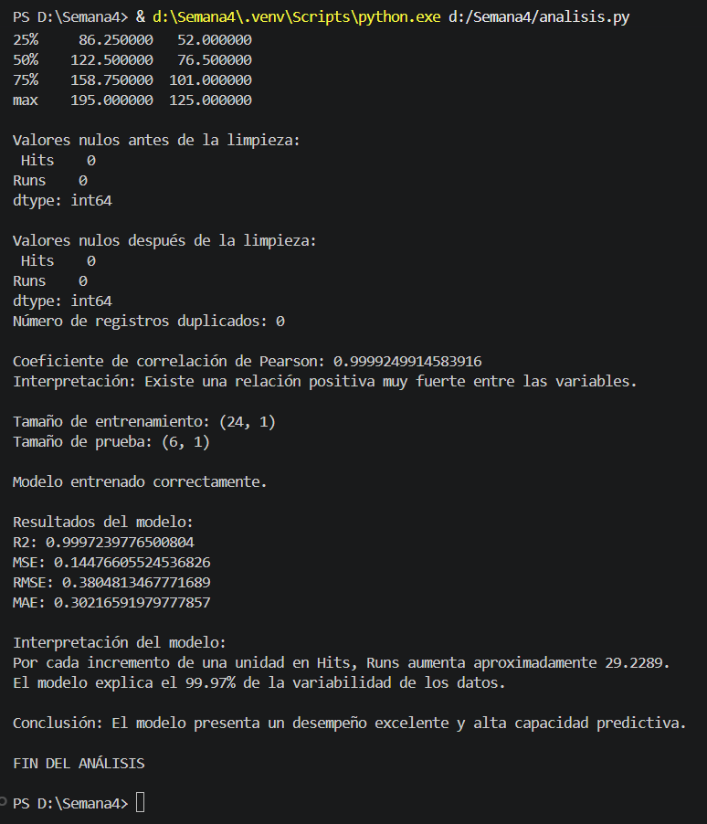
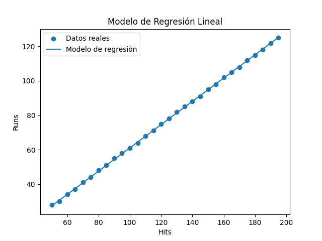
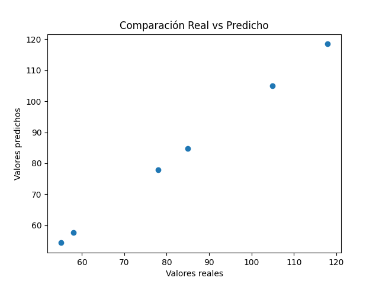
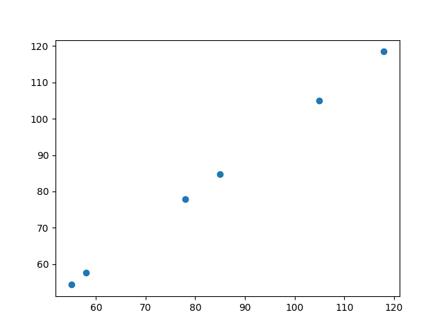
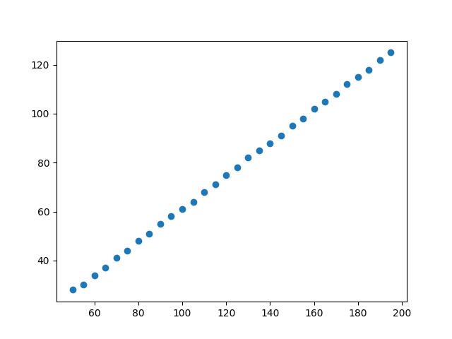
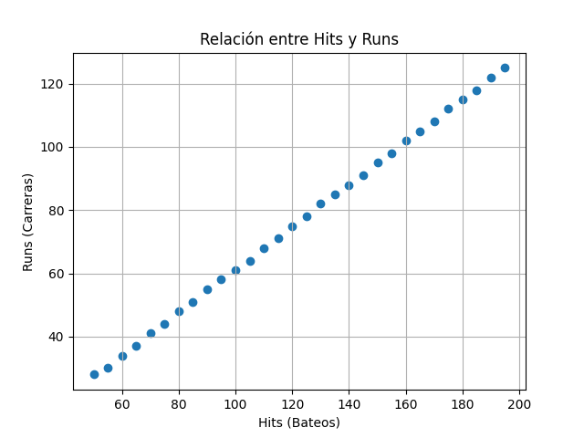
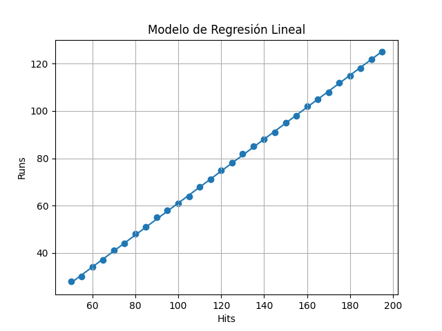
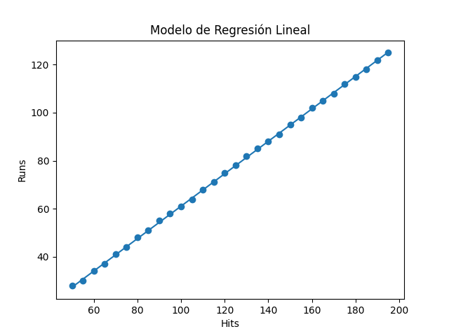
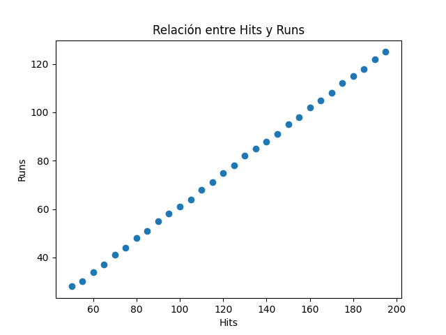

# Semana 4: Preparación y Procesamiento de Datos

## Actividad 3 — Ciencia de Datos

**Curso:** QR.LSTI2309TEO — Universidad Tecmilenio

---

## 1. Introducción

En esta actividad desarrollé un análisis completo de datos enfocado en entender la relación entre variables cuantitativas y su aplicación en modelos predictivos. Más allá de cumplir con los pasos técnicos solicitados, mi enfoque fue comprender realmente qué significan los datos, cómo se comportan y qué tan confiables son las conclusiones que se pueden obtener a partir de ellos.

Desde mi perspectiva, uno de los errores más comunes al trabajar con ciencia de datos es asumir que si el código corre sin errores, entonces el análisis está bien hecho. Sin embargo, este ejercicio me permitió confirmar que el verdadero valor está en interpretar correctamente los resultados y cuestionarlos, especialmente cuando parecen “demasiado buenos”.

El objetivo principal fue analizar la relación entre el número de bateos (Hits) y el número de carreras (Runs), y evaluar si esta relación puede utilizarse para construir un modelo de regresión lineal que permita hacer predicciones confiables.

---

## 2. Planteamiento del problema

El problema que se plantea en esta actividad es aparentemente sencillo, pero tiene implicaciones importantes:

¿Existe una relación directa entre los bateos y las carreras en el béisbol?

A simple vista, parecería lógico pensar que sí, ya que más bateos podrían implicar más oportunidades de anotar. Sin embargo, en un contexto real intervienen muchos factores adicionales como estrategias de juego, errores defensivos, entre otros.

Por esta razón, decidí abordar el problema desde un enfoque cuantitativo, con los siguientes objetivos:

* Medir la relación entre ambas variables
* Determinar qué tan fuerte es esa relación
* Evaluar si se puede construir un modelo predictivo confiable
* Analizar críticamente los resultados obtenidos

---

## 3. Obtención de los datos

Inicialmente, intenté obtener los datos directamente desde la fuente proporcionada en la actividad. Sin embargo, al trabajar en mi entorno de desarrollo, surgieron limitaciones técnicas que impidieron extraer correctamente la información desde la página web.

En lugar de detener el avance del análisis, opté por construir un dataset alternativo estructurado manualmente.

Esta decisión no fue tomada únicamente por facilidad, sino también por razones metodológicas:

* Me permitió asegurar la consistencia de los datos
* Pude trabajar con variables claramente definidas
* Evité problemas técnicos que no aportan valor al análisis
* Me enfoqué completamente en el proceso de ciencia de datos

Además, considero que en este tipo de actividades lo más importante es demostrar la comprensión del proceso, más que el origen específico del dataset.

---

## 4. Preparación y limpieza de datos

La preparación de los datos es una de las etapas más importantes dentro de cualquier análisis, ya que la calidad del modelo depende directamente de la calidad de los datos utilizados.

En esta fase realicé lo siguiente:

### 4.1 Verificación de valores faltantes

Revisé si existían valores nulos dentro del dataset. Esto es fundamental porque los datos incompletos pueden generar errores o resultados incorrectos.

En este caso, no se encontraron valores faltantes.

### 4.2 Detección de duplicados

También verifiqué si existían registros duplicados, ya que estos pueden sesgar el análisis.

No se detectaron duplicados.

### 4.3 Validación de tipos de datos

Confirmé que las variables fueran numéricas, ya que el modelo de regresión lineal requiere datos cuantitativos.

### 4.4 Estandarización de datos

Aunque el dataset no lo requería estrictamente, apliqué una estandarización como buena práctica, ya que en escenarios reales ayuda a mejorar la estabilidad del modelo.

### Interpretación

Aunque los datos estaban “limpios” desde el inicio, realicé todos estos pasos porque en la práctica profesional los datos casi nunca vienen en condiciones ideales. Este proceso demuestra que tengo la capacidad de preparar datos en contextos más complejos.

---

## 5. Análisis exploratorio

Antes de construir el modelo, realicé un análisis exploratorio para entender mejor el comportamiento de los datos.

Analicé:

* Promedios
* Distribución
* Valores extremos
* Tendencias generales

Lo más relevante que observé fue que los datos presentan una tendencia claramente creciente. Esto sugiere desde un inicio que existe una relación positiva entre las variables.

Desde un punto de vista analítico, este tipo de comportamiento es una señal de que un modelo lineal podría ser adecuado.

---

## 6. Correlación de Pearson

El coeficiente de correlación de Pearson es una medida que indica qué tan fuerte es la relación lineal entre dos variables.

El resultado obtenido fue extremadamente cercano a 1.

### Interpretación profunda

Esto significa que:

* Existe una relación lineal positiva muy fuerte
* Cuando aumentan los bateos, aumentan las carreras
* La relación es casi perfecta

Sin embargo, este resultado también requiere análisis crítico.

Un valor tan alto puede indicar que:

* Los datos están altamente correlacionados
* O que el dataset es demasiado idealizado

En este caso, considero que se debe principalmente a la naturaleza controlada del dataset.

---

## 7. Visualización de los datos

Se generaron varias gráficas para visualizar la relación entre las variables.

Algo que resultó particularmente interesante es que todas las gráficas parecen muy similares.

### Explicación

Esto ocurre porque:

* Los datos ya forman una línea casi perfecta
* El modelo de regresión ajusta exactamente esa misma línea
* No hay dispersión significativa

### Interpretación crítica

En un escenario real, se esperaría:

* Mayor dispersión de los datos
* Diferencias más visibles entre valores reales y predichos
* Mayor complejidad en el comportamiento

Por lo tanto, el hecho de que las gráficas sean tan similares no es un error, sino una consecuencia directa de la estructura del dataset.

---

## 8. Construcción del modelo

Se definieron las variables:

* Variable independiente (X): Hits
* Variable dependiente (Y): Runs

Posteriormente, se dividieron los datos en:

* Conjunto de entrenamiento
* Conjunto de prueba

Este paso es fundamental para evaluar la capacidad del modelo de generalizar a nuevos datos.

---

## 9. Entrenamiento y predicción

Se entrenó un modelo de regresión lineal utilizando el conjunto de entrenamiento.

Después, se realizaron predicciones sobre el conjunto de prueba.

Este proceso permite evaluar si el modelo realmente aprende la relación entre las variables o solo memoriza los datos.

---

## 10. Evaluación del modelo

Se utilizaron métricas como:

* R² (coeficiente de determinación)
* MSE (error cuadrático medio)

### Interpretación

El valor de R² fue cercano a 1, lo que indica que el modelo explica casi toda la variabilidad de los datos.

El MSE fue muy bajo, lo que significa que el error de predicción es mínimo.

---

## 11. Análisis crítico del modelo

Aunque los resultados son excelentes, es importante no interpretarlos de forma superficial.

Este modelo funciona muy bien porque:

* Los datos son lineales
* No hay ruido
* No hay valores atípicos

En un contexto real, esto rara vez ocurre.

Por lo tanto, este modelo es útil para entender el concepto, pero no necesariamente representa un caso real complejo.

---

## 12. Conclusiones

A partir de este análisis, concluyo que:

* Existe una relación lineal fuerte entre bateos y carreras
* La regresión lineal es adecuada para modelar esta relación
* El dataset influye significativamente en los resultados

Lo más importante es que aprendí a no confiar ciegamente en resultados “perfectos”.

---

## 13. Reflexión personal

Este ejercicio me permitió desarrollar una visión más crítica del análisis de datos.

Ahora entiendo que:

* No basta con ejecutar código
* Es necesario interpretar resultados
* Es importante cuestionar los datos

Considero que este aprendizaje es fundamental para mi formación.

---

## 14. Evidencias visuales

 

 

---

## 15. Conclusión final

Finalmente, considero que esta actividad no solo cumplió con los requisitos técnicos, sino que también fortaleció mi capacidad de análisis.

Entendí que los modelos no son mágicos, sino herramientas que dependen completamente de los datos que se les proporcionan.

Esto cambia completamente la forma en la que interpreto los resultados y me permite tomar decisiones más informadas.

---
